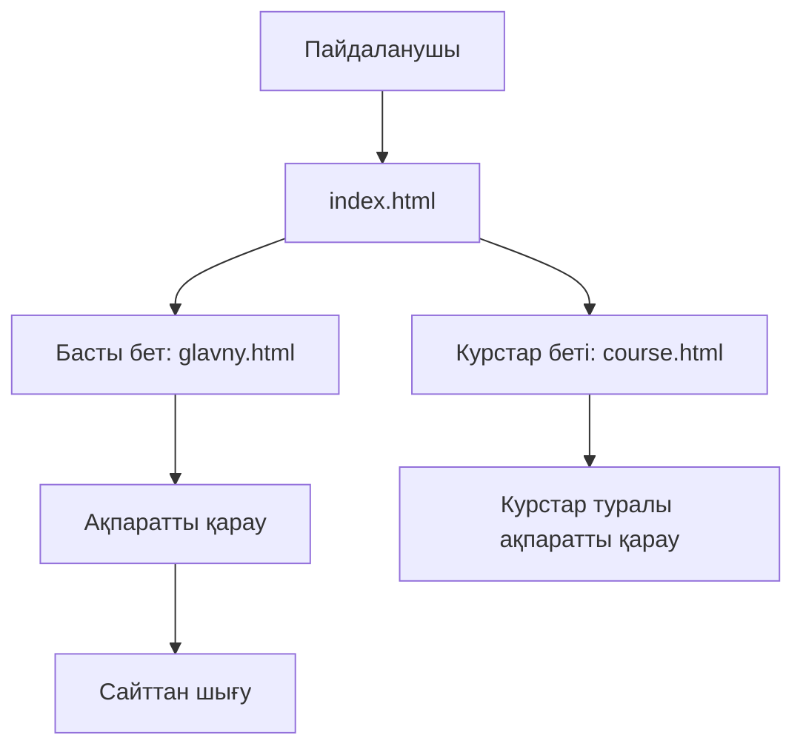

platforma/

├── README.md

├── index.html

├── glavny.html

├── course.html

├── script.js

├── index.js

├── style.css

├── imgg/

└── docs/
    ├── requirements.md
    ├── use-case.md
    └── diagrams/
        └── use-case.md
        

# 1-диаграмма. Platforma веб-сайтының құрылымы

## Түсіндірме

1. Пайдаланушы сайтты ашады.
2. `index.html` бастапқы бетті көрсетеді.
3. Пайдаланушы басты бетке немесе курстар бетіне өте алады.
4. Басты беттен сайт туралы ақпаратты қарайды.
5. Курстар бетінен курстар туралы ақпаратты оқиды.

## Қорытынды

Диаграмма Platforma веб-сайтының негізгі беттері мен пайдаланушының сайт ішінде қозғалуын сипаттайды.
